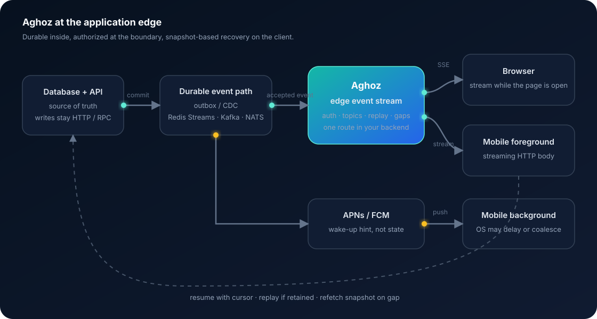

<h1 align="center">aghoz</h1>

<p align="center">
  <sub><em>AH-gohz</em> — from the Filipino <em>agos</em>, "flow".</sub>
</p>

<p align="center">
  <strong>Resumable, authorized event streams for apps that already have a backend.</strong><br>
  Live server-to-client updates that mount into your existing app as a route — so your
  authentication runs first, retained events replay, and an uncloseable gap becomes a refetch.<br>
  <sub><strong>Node.js only</strong> for now — Express, Fastify, NestJS on the server; React, Vue, Svelte in the
  browser. The protocol core is Rust behind a C ABI, so other languages follow.</sub>
</p>

<p align="center">
  <a href="https://github.com/thinkgrid-labs/aghoz/actions/workflows/ci.yml"></a>
  <a href="#license"></a>
  
  
  
</p>

```js
app.get('/events', hub.handler({
  authorize: (req, topic) => topic.startsWith(`org/${req.user.orgId}/`),
}))
```

No second service. No token exchange. No CORS when the UI and API share an origin.

**aghoz** is a small, dependency-free edge event-stream library. It ships today for
**Node.js** — **Express**, **Fastify**, **NestJS**, **React**, **Vue** and **Svelte** — and the protocol is specified and
conformance-tested independently of any one runtime, so further languages are a binding
rather than a rewrite. It replaces polling (`refetchInterval`,
`setInterval` + `fetch`) with live server-to-client updates over **Server-Sent Events**,
without the second service that **Mercure** or **Centrifugo** require and without the
client-side database that a sync engine like **ElectricSQL** or **PowerSync** brings.
Events accepted by the hub resume from a cursor; if retained history cannot close an
interruption, the client is told to refetch instead of trusting an incomplete stream.
Scale past one process with an optional **Redis Streams** backplane. Written in
**TypeScript**, with a **Rust** protocol core behind a C ABI for other languages.

<p align="center">
  
</p>

---

> ### ⚠️ Early. Read this before you depend on it.
>
> **Node.js only.** Every package is Node 22+. There is no Python, PHP, Go or Ruby adapter
> — the Rust core, the C ABI and the two conformance corpora exist so that there can be,
> and Go is first in line. See [the roadmap](#v05--adapters-in-other-languages).
> Bun 1.3.14 also has a compatibility lane covering the HTTP corpus, NestJS/Express and
> Redis Streams for the first production canary. Node remains the supported runtime; this
> does not promise compatibility with every Bun release.
>
> **The API may still change**, and so may the wire protocol until it is tagged. There is
> no deprecation policy yet.
>
> **The name is settled.** `aghoz` is final — see [DECISIONS.md](./DECISIONS.md) D4. It
> was held provisionally until there was something to decide it on, which is why the
> protocol carries the name nowhere and a test still enforces that.
>
> What *is* real: the protocol is specified in [PROTOCOL.md](./PROTOCOL.md) and enforced
> by two shared corpora — [97 vectors](./conformance/) pinning the protocol core and
> [42 scenarios](./conformance/http/) pinning the HTTP layer over a real socket, both
> language-neutral. The packages pass 267 tests plus 74 in Rust, the unsafe in the C ABI
> is verified by Miri, and the [example app](./examples/express-react) runs end to end in
> CI. Every significant decision — including the three that were reversed — is recorded
> with its evidence in [DECISIONS.md](./DECISIONS.md).

---

## Contents

- [Why this exists](#why-this-exists)
- [How it works](#how-it-works)
- [How aghoz compares](#how-aghoz-compares)
- [Read this before installing](#read-this-before-installing)
- [What makes it different](#what-makes-it-different)
- [Install](#install)
- [Server setup](#server-setup) — [Express](#express) · [Fastify](#fastify) · [NestJS](#nestjs)
- [Client setup](#client-setup) — [React](#react) · [Vue 3](#vue-3) · [Svelte](#svelte) · [anything else](#everything-else) · [TanStack Query](#with-tanstack-query)
- [Things that will bite you](#things-that-will-bite-you)
- [Multiple processes (Redis backplane)](#multiple-processes-redis-backplane)
- [Multiple tabs (one shared connection)](#multiple-tabs-one-shared-connection)
- [Observability](#observability)
- [Packages](#packages)
- [Why Rust?](#why-rust)
- [FAQ](#faq)
- [Roadmap](#roadmap)
- [Example app](#example-app)
- [Documentation](#documentation)
- [Contributing](#contributing)
- [License](#license)

---

## Why this exists

**Most web apps poll.** A client asks the server every few seconds whether anything
changed, and almost every time the answer is no. That wastes battery, wastes requests,
and *still* leaves the interface seconds behind reality. A dashboard on a five-second
interval costs 720 requests an hour, per tab, to mostly learn nothing.

The push alternatives each charge a tax that has little to do with pushing:

**Standalone hubs** — Mercure, Centrifugo — are a second service to deploy, monitor and
keep alive. Worse, that service has never seen your user table. Because it cannot answer
"may this person read this?", you must build a whole authorization subsystem before one
message flows: minting tokens, scoping them to topics, handling expiry, handling
rotation, handling revocation. That subsystem is usually the largest part of the
integration, and it exists only because the hub lives outside your application.

**Sync engines** — ElectricSQL, PowerSync, Zero — are excellent, and they solve a much
larger problem than the one you have. They replace your data layer rather than augmenting
it: a client-side database, a replication protocol, conflict resolution, a migration
story. If you want offline-first local writes, use one of them. If you just wanted the
number on the screen to be current, you have adopted a new architecture to get it.

**Hand-rolled SSE** is fifteen lines that work perfectly on your laptop and fail in
production for reasons nobody on the team remembers a month later:

- compression middleware buffers the stream, so nothing arrives until the connection ends
- a proxy reaps the connection as idle, and it silently stops delivering
- subscribers leak on disconnect, one per tab that ever connected
- and updates go missing across reconnects, with **nothing reporting it**

That last one is the worst, and it is why this project exists. A client showing stale
data forever is worse than one that polls, because nothing fails. No error is logged, no
retry fires, no alert goes off. The page just quietly lies, and the first you hear of it
is a support ticket saying the numbers look wrong.

**So there is no small, deliberate option** for a team that wants to stop polling without
changing anything else about how their application works. That is the gap this fills:
push that can prove whether accepted, retained events cover a reconnect, mounted inside
the app you already have, small enough to read in one sitting.

---

## How it works

Aghoz sits at the **application edge**. Your database and APIs remain the source of truth;
the stream is the low-latency signal that tells a UI what changed. In the smallest
deployment, the write path publishes directly to an in-process hub. Where an event must
survive a crash between the database commit and publication, put a transactional outbox
or CDC in front of the hub and use Redis Streams, Kafka, NATS or another durable log
internally.

The browser never connects to that broker. Aghoz applies the application's existing
authentication and topic authorization, translates the internal log into one resumable
HTTP stream, and tells the client when bounded history is no longer enough. On a gap, the
client reads a fresh snapshot from the ordinary API.

This is **Kafka-like replay at the UI boundary, not Kafka for browsers**. Browser tabs and
phones are ephemeral observers, not durable consumer groups: there are no client
acknowledgements, no server-held offset per device, and no claim that a handler processed
an event successfully. On mobile, stream only while the app is foregrounded; APNs or FCM
is a wake-up hint while it is backgrounded, followed by replay or a snapshot refresh.

---

## How aghoz compares

|  | aghoz | Mercure / Centrifugo | Socket.IO | ElectricSQL / PowerSync / Zero | Hand-rolled SSE |
|---|---|---|---|---|---|
| **Extra service to run** | no — a route in your app | yes | no | yes (sync service) | no |
| **Authorization** | your existing middleware, one function | JWTs scoped to topics, minted by you | your own handshake code | row/shape rules in the sync layer | yours to write |
| **Interrupted delivery** | replay accepted events or report `onGap` | reconnect replay, loss not surfaced | at-most-once by default | reconciled by the sync engine | silent |
| **Transport** | SSE over plain HTTP | SSE / WebSocket | WebSocket + fallbacks | WebSocket | SSE |
| **Direction** | server → client only | server → client | bidirectional | bidirectional sync | server → client |
| **Client-side database** | none | none | none | yes | none |
| **Offline / local writes** | no | no | no | yes | no |
| **Multi-process** | optional Redis Streams backplane | built in | Redis adapter | built in | yours to write |
| **Dependencies** | zero | a service + a client | several | a service + a client | zero |

Read that table as scope, not scoring. If you need bidirectional messaging, use
Socket.IO. If you need offline-first local writes, use a sync engine. aghoz is for
the case where the server already knows something and the browser or foreground mobile
app should stop asking. Kafka, NATS and Redis Streams may sit behind Aghoz; they are not
the client transport.

---

## Read this before installing

**It will not work on serverless.** Vercel, Lambda and Cloudflare Workers cannot hold a
long-lived connection. There is no workaround and none is planned. If that is your
deployment target, stop here.

**Across multiple processes you need a backplane.** By default a `publish` reaches only
that process's subscribers, and aghoz warns at startup when it can tell it is one
worker of several. Add `@aghoz/redis` and the limitation goes away — see
[Multiple processes](#multiple-processes-redis-backplane). Redis is entirely optional;
without it there are no dependencies at all.

**It is not a sync engine.** No offline support, no local writes, no CRDT conflict
resolution, no client-side database. If you need those, see the paragraph above — you
will be happier with a real sync engine than with a bad imitation. Writes here go through
the API you already have; the stream is one-way, permanently.

---

## What makes it different

**Authorization is inherited, not invented.** The hub is a route inside your application,
so by the time it runs, your session middleware has already established who the user is.
The answer to "may this user read this topic?" is a function call against the request you
already parsed:

```js
authorize: (req, topic) => topic.startsWith(`org/${req.user.orgId}/`)
```

That one line replaces the entire token subsystem a standalone hub requires. It is the
single largest source of complexity in every competing product, and mounting in-process
deletes it rather than simplifying it.

**An interrupted accepted stream fails loudly.** Two transport loss conditions are
detected and reported through one callback:

- `history-truncated` — the client reconnected with a cursor older than retained history
- `slow-consumer` — the client could not drain its socket and was disconnected rather
  than left to starve, quietly diverging

```jsx
<AghozProvider url="/events" onGap={() => queryClient.invalidateQueries()}>
```

Wiring that one prop to a refetch means a client does not keep trusting a stream that the
hub knows is incomplete. This covers events the hub or backplane accepted; it cannot
detect an application that forgot to publish, a publish that failed after a database
commit, or a handler that received an event and then failed. Those boundaries are
explicit below rather than hidden inside the word "delivery."

**It is small enough to read.** The entire protocol is two endpoints and one header, all
of it in [PROTOCOL.md](./PROTOCOL.md). The target is that a developer understands the
whole system in ten minutes.

### The delivery contract

| Boundary | What aghoz promises |
|---|---|
| Hub or backplane accepted the event | a monotonic id, bounded replay and ordered delivery on the shared sequence |
| Connection ended | reconnect from the last received cursor; replay if retained, otherwise `onGap` |
| Application handler ran | the cursor means **received**, not successfully processed; handler failures are reported but not retried |
| Database transaction committed | no promise unless publication is made durable with an outbox or CDC |
| Mobile app is backgrounded | no held stream; APNs or FCM wakes the app, which then resumes or refetches |

The safest default is therefore an **invalidation event**: keep the API response as the
authoritative state, use Aghoz to say "this changed," and refetch on the event or on a
gap. Folding event payloads directly into client state is the faster, sharper option and
requires idempotent, non-throwing handlers.

---

## Install

**Node only.** Every package here runs on Node 22+, and there is no adapter for any other
language yet — the C ABI and the two conformance corpora exist so that there can be, and
Go is first in line. See [the roadmap](#v05--adapters-in-other-languages).

Pick the server adapter for your framework and the client binding for your UI. Everything
else is optional.

```sh
# server — one of these
pnpm add @aghoz/server                 # Express, or plain node:http
pnpm add @aghoz/server @aghoz/fastify  # Fastify
pnpm add @aghoz/server @aghoz/nest     # NestJS

# client — one of these
pnpm add @aghoz/client @aghoz/react    # React
pnpm add @aghoz/client @aghoz/vue      # Vue 3
pnpm add @aghoz/client @aghoz/svelte   # Svelte 4 or 5
pnpm add @aghoz/client                 # anything else

# optional
pnpm add @aghoz/react-query            # TanStack Query adapter
pnpm add @aghoz/redis                  # more than one process
pnpm add @aghoz/history-file           # replay that survives a restart
```

`@aghoz/server` and `@aghoz/client` have **zero runtime dependencies**. The framework
packages take yours as a peer and add nothing.

---

## Server setup

Three steps in every framework, and the second and third are identical everywhere:

1. **Create a hub** and mount the stream **after** your authentication middleware.
2. **Publish** from the write path you already have.
3. **Hand the page a cursor** with its initial data, which closes the cold-start window.

Mount order is the entire security model. Everything above the mount has already run, so
`req.user` exists and `authorize` never has to parse a token.

### Express

```js
import express from 'express'
import { createHub } from '@aghoz/server'

const app = express()
const hub = createHub()

app.use(session())        // already there
app.use(loadUser)         // already there — sets req.user

// 1. mount the stream, AFTER your auth middleware
app.get('/events', hub.handler({
  authorize: (req, topic) => topic.startsWith(`org/${req.user.orgId}/`),
  connectionKey: (req) => req.user.id,     // §10 — caps connections per user
}))
app.get('/events/cursor', hub.cursorHandler())

// 2. publish from the write path you already have
app.post('/api/orders', async (req, res) => {
  const order = await db.orders.insert(req.body)
  res.json(order)
  hub.publish(`org/${req.user.orgId}/orders`, order)
})

// 3. hand the page a cursor alongside its data
app.get('/api/bootstrap', (req, res) => {
  res.json({ orders: recentOrders, cursor: hub.cursor() })
})
```

Plain `node:http` is the same — `hub.handler()` takes `(req, res)` and expects nothing
Express-specific.

### Fastify

`registerAghoz` mounts both routes and handles the two Fastify-specific details for you.

```js
import Fastify from 'fastify'
import { createHub } from '@aghoz/server'
import { registerAghoz } from '@aghoz/fastify'

const app = Fastify()
const hub = createHub()

await app.register(authPlugin)   // already there — decorates request.user

// 1. mount. `${path}/cursor` is registered alongside it.
await registerAghoz(app, {
  hub,
  path: '/events',
  authorize: (req, topic) => topic.startsWith(`org/${req.user.orgId}/`),
  connectionKey: (req) => req.user.id,
})

// 2. publish
app.post('/api/orders', async (req, reply) => {
  const order = await db.orders.insert(req.body)
  hub.publish(`org/${req.user.orgId}/orders`, order)
  return order
})

// 3. bootstrap
app.get('/api/bootstrap', async () => ({ orders: recentOrders, cursor: hub.cursor() }))
```

Two things the adapter does that you would otherwise have to know about. It calls
`reply.hijack()`, without which Fastify assumes it owns the response, serialises it and
truncates the stream. And it passes `toNodeRequest: (req) => req.raw`, because Fastify
keeps decorations like `request.user` on its own wrapper while the socket and its close
events live on the raw request — `authorize` needs the first, the connection lifecycle
needs the second.

Wiring the routes yourself instead? Use `toFastifyHandler(options)`.

### NestJS

**Nest's own `@Sse()` decorator cannot be used**, and that is why this package exists.
`@Sse()` takes an Observable and writes the response itself — it owns the status, the
headers and the framing, and offers no way to add one of your own. So the
`last-event-id-checkpoint` header (§4.4) is unreachable and a client can never be told it
missed events, which is the whole point of the library.

Works on **both the Express and Fastify platforms**.

```ts
// 1a. register the module
@Module({ imports: [AghozModule.forRoot({ maxHistoryBytes: 16 * 1024 * 1024 })] })
export class AppModule {}
```

```ts
// 1b. write the controller yourself, with your own guards on it
@Controller('events')
@UseGuards(AuthGuard)
export class EventsController {
  private readonly stream: ReturnType<typeof createAghozHandler>

  constructor(@InjectHub() private readonly hub: AghozHub) {
    // Once, in the constructor — never inside the route method. `revalidateMs` schedules
    // an interval per handler, so one per request leaks a timer per connection.
    this.stream = createAghozHandler(hub, {
      authorize: (req, topic) => topic.startsWith(`org/${req.user.orgId}/`),
      connectionKey: (req) => req.user.id,
    })
  }

  @Get()
  events(@Req() req: Request, @Res() res: Response) {
    return this.stream(req, res)
  }

  @Get('cursor')
  async cursor() {
    return { cursor: await this.hub.sharedCursor() }
  }
}
```

```ts
// 2. publish from a service
@Injectable()
export class OrdersService {
  constructor(@InjectHub() private readonly hub: AghozHub) {}

  async create(orgId: string, input: CreateOrderDto) {
    const order = await this.repo.save(input)
    this.hub.publish(`org/${orgId}/orders`, order)
    return order
  }
}
```

**This package deliberately does not mount a controller for you.** A route it registered
would carry none of your `@UseGuards()`, and guards are where a Nest application's
authentication lives — so an auto-mounted stream would be the one route in your app that
bypassed it.

Three things that will bite you:

- Use a **bare `@Res()`**. `@Res({ passthrough: true })` leaves Nest in charge of ending
  the response, and it will end it — closing the stream the moment the method returns.
- Build the handler **in the constructor**, not in the route method.
- Config that is not known at import time — a Redis backplane, whose factory is async —
  uses `forRootAsync`:

```ts
AghozModule.forRootAsync({
  imports: [ConfigModule],
  inject: [ConfigService],
  useFactory: async (config: ConfigService) => ({
    backplane: await createRedisBackplane({
      redis: new Redis(config.get('REDIS_URL')),
      subscriber: new Redis(config.get('REDIS_URL')),
    }),
  }),
})
```

The module also closes the hub on `beforeApplicationShutdown`. That hook, rather than
`onApplicationShutdown`, is load-bearing: Nest closes the HTTP server *between* the two,
and `server.close()` waits for open connections to end. An SSE stream never ends on its
own, so a hub still holding subscribers at that point means `app.close()` never resolves.

---

## Client setup

Two steps everywhere: **provide a connection once at the root**, then **read a topic
where you render**. One connection serves the whole app however many topics it carries.

Wire `onGap` to a refetch. It prevents a known-incomplete accepted stream from remaining
the UI's source of truth, and it is the reason to use this over fifteen lines of
hand-rolled SSE.

### React

```jsx
import { AghozProvider, useTopic, useTopicReducer } from '@aghoz/react'

// 1. provide once, at the root
<AghozProvider
  url="/events"
  initialCursor={boot.cursor}
  onGap={() => queryClient.invalidateQueries()}
>
  <App />
</AghozProvider>
```

```jsx
// 2. read where you render
function Revenue({ initial }) {
  const revenue = useTopic(`org/${orgId}/revenue`, initial)
  return <strong>{format(revenue)}</strong>
}
```

The migration this replaces:

```diff
- const { data } = useQuery({
-   queryKey: ['revenue'], queryFn: fetchRevenue,
-   refetchInterval: 5000,          // 720 requests per hour, per tab
- })
+ const data = useTopic(`org/${orgId}/revenue`, initial)
```

Also available: `useTopicEffect` for a side effect per event, `useConnectionState` for a
status indicator, and `useAghoz` for the client itself.

### Vue 3

Provide once in a root `setup()`, then use composables anywhere below it.

```vue
<script setup>
import { provideAghoz, useTopic, useTopicReducer } from '@aghoz/vue'

// 1. provide once
provideAghoz({ url: '/events', initialCursor: props.cursor, onGap: () => refetch() })

// 2. read. The topic may be a ref or a getter; changing it resubscribes.
const revenue = useTopic('org/42/revenue', 0)
const orders = useTopicReducer('org/42/orders', (list, order) => [...list, order], [])
</script>
```

The returned ref is **shallow**, deliberately. A deep one would wrap every payload in a
reactive proxy, so an object you published would not be `===` the object you receive and
any identity check downstream would silently stop working. Payloads arrive whole and are
replaced whole; there is nothing for deep reactivity to do but cost.

### Svelte

Set the client in context once, then use stores.

```svelte
<script>
  import { setAghozClient, topic, topicReducer } from '@aghoz/svelte'
  export let cursor

  // 1. set once
  setAghozClient({ url: '/events', initialCursor: cursor, onGap: () => refetch() })

  // 2. read
  const total = topic('org/42/revenue', 0)
</script>

<p>{$total}</p>
```

These are `svelte/store` readables rather than runes. One package therefore covers Svelte
4 and 5 with no compiler step and no rune syntax pinning it to a major version — and the
lifetime comes free: a readable starts on its first subscriber and tears down after its
last, so `$total` auto-subscription *is* the subscription lifecycle. Nothing to clean up,
and no leak when a component is destroyed.

### Everything else

`@aghoz/client` is framework-agnostic and is what the three packages above are built on.

```js
import { createClient } from '@aghoz/client'

const client = createClient({
  url: '/events',
  initialCursor: boot.cursor,
  onGap: () => refetch(),
})

const off = client.subscribe('org/42/orders', (data, meta) => {
  render(JSON.parse(data), meta.id)
})
```

### Authenticated cross-origin clients

When the web app and API use different origins, configure authentication on the stream just
as you do on the rest of the API. Cookie sessions need `credentials: 'include'`:

```jsx
<AghozProvider
  url="https://api.example.com/events"
  credentials="include"
  initialCursor={boot.cursor}
  onGap={() => queryClient.invalidateQueries()}
>
  <App />
</AghozProvider>
```

Bearer tokens and API keys use a header factory. It is evaluated on the initial request and
again on every reconnect, so it sees a token refreshed while the previous stream was open:

```js
const client = createClient({
  url: 'https://api.example.com/events',
  headers: () => ({ authorization: `Bearer ${auth.currentAccessToken()}` }),
  onGap: () => refetch(),
})
```

`Accept` and `Last-Event-ID` belong to the protocol and override values supplied by the
application. In React, keep a header factory stable (module scope or `useCallback`) so a
render does not replace the provider's client. `provideAghoz`, `setAghozClient` and
`createSharedClient` accept the same `credentials`, `headers` and injected `fetch` options.

The API must opt into credentialed CORS. For NestJS, use exact production origins rather
than `*`, allow the cursor and authentication headers, and expose the checkpoint header:

```ts
app.enableCors({
  origin: ['https://admin.example.com', 'https://partners.example.com'],
  credentials: true,
  allowedHeaders: ['Authorization', 'Content-Type', 'Last-Event-ID', 'X-Api-Key', 'X-Origin'],
  exposedHeaders: ['Last-Event-ID-Checkpoint'],
})
```

The checkpoint exposure is correctness-sensitive: the client reads it to decide whether
retained history can close a reconnect. Verify the OPTIONS preflight and the streaming GET
through the real production proxy, not only against the Nest process directly.

Every function in the Vue and Svelte packages also accepts an explicit `client`, which is
what makes them usable outside a component — in a plain module, or a test, where
injection and Svelte context cannot be read.

### Collections need a fold, not a cell

`useTopic` is a last-value cell. It is right for a dashboard number or a status, and
wrong for a growing list — an event carries one new order, not the list containing it.

```jsx
const orders = useTopicReducer(
  `org/${orgId}/orders`,
  (list, order) => [order, ...list].slice(0, 50),
  initialOrders,
)
```

`topicReducer` in Svelte and `useTopicReducer` in Vue are the same idea.

### With TanStack Query

Keep React Query for fetching and cache management; delete the interval and let the
stream invalidate.

```jsx
import { useTopicInvalidation, useTopicQueryData } from '@aghoz/react-query'

// The refetchInterval replacement — ignores the payload, so no push shape has to match
// the endpoint's.
useTopicInvalidation(`org/${orgId}/orders`, ['orders'])

// Or fold events straight into the cache, with no refetch at all.
useTopicQueryData(`org/${orgId}/orders`, ['orders'], (list = [], order) => [order, ...list])
```

Both register for gaps and invalidate on one, because a folded cache is only correct
while every accepted event was received and every handler succeeded. Prefer invalidation
unless the extra refetch is measurably a problem.

---

## Things that will bite you

**The cold-start window.** Between your page reading its data and the browser opening the
stream, anything published is lost — and without a cursor, *nothing reports it*. This is
on every first page load. Pass `hub.cursor()` alongside your initial data and hand it
back as `initialCursor`. It is two lines and it closes the only hole in the gap-detection
story for the page's initial topic set. With a backplane, `hub.cursor()` is this process's
view of the shared sequence —
correct from boot once you have awaited `hub.ready()`, and behind it afterwards by at
most the reader's round trip. `await hub.sharedCursor()` pays a round trip to close that
last gap exactly; reach for it if replaying an event your snapshot already reflects is
not idempotent for your client.

**A restart makes every connected client refetch.** The hub's history is in memory, so a
restarted process cannot vouch for a resuming client's cursor — it says so, the client
gets a gap, and it refetches. That is correct, and on a busy deploy it is also every
client at once. `@aghoz/history-file` turns it back into an ordinary replay for a
single-process deployment; a Redis backplane already does, because a Redis stream is a
persistent shared history.

**`publish` is not transactional with your database write.** A crash between the two, an
ignored rejected promise, or a forgotten call loses the event with no record that it
existed. `onGap` cannot report an event the hub never accepted. If you truly cannot lose
an event, use a transactional outbox or CDC and treat direct `hub.publish()` as the
low-ceremony path rather than the durable one.

**Your service worker can buffer the stream.** A worker doing
`respondWith(fetch(event.request))` defeats every header the server sets, without
touching your server. If your stream hangs and you have a service worker, that is
where to look first.

**Cross-origin auth needs both sides configured.** `credentials: 'include'` makes the
browser send cookies; it does not make the API's CORS policy accept them. Likewise, an
`Authorization` header or the protocol's `Last-Event-ID` causes a preflight. Allow those
headers, use an exact origin with credentials, and expose `Last-Event-ID-Checkpoint`.

**HTTP/1.1 costs one of six connections per origin.** One connection per tab, so this is
rarely fatal, but it disappears entirely under HTTP/2 — worth having on before you
measure anything. If your users keep many tabs open,
[`createSharedClient`](#multiple-tabs-one-shared-connection) reduces all of them to one.

**Adding a topic reconnects.** There is no client-to-server channel by design, so a
changed topic set means a new connection carrying the current cursor. Mounts inside one
render pass are debounced into one connection; churning topics on every render is not.

**A cursor only covers the topic set that produced it.** A global cursor cannot prove
that initial state for a lazily added topic is current: another topic may advance the
cursor past an event the new topic needed before the replacement connection opens. Until
the pre-1.0 cutover contract is implemented, fetch or invalidate a newly added topic
after its replacement stream opens; do not begin a client-side fold for a lazy topic from
an earlier global cursor. Initial page topics stamped with the bootstrap cursor are not
affected.

**Received is not processed.** The client advances its cursor before invoking handlers so
one broken component cannot block or replay the whole shared stream. A handler that
throws is reported through `onError`, not retried. Invalidation handlers naturally
recover by fetching authoritative state; payload reducers should catch parse/reducer
errors and invalidate too.

---

## Multiple processes (Redis backplane)

Skip this if you run one process. Nothing below is needed, and nothing above changes.

Once you run pm2 in cluster mode, several pods, or anything horizontally scaled, a
publish in one process has to reach subscribers in the others. That is what a backplane
does:

```js
import { createRedisBackplane } from '@aghoz/redis'
import Redis from 'ioredis'

const hub = createHub({
  backplane: await createRedisBackplane({
    redis: new Redis(url),
    // A second connection, because XREAD BLOCK monopolises the one it runs on.
    subscriber: new Redis(url),
  }),
})
```

It is built on **Redis Streams**, not pub/sub, and the reason decides everything else:
`XADD` assigns exactly the `<ms>-<seq>` id this protocol uses. So Redis becomes the
sequencer — no per-process counter, no two pods minting the same id, no client silently
discarding a real event as already-seen. The stream doubles as the shared history, which
is what lets a client reconnect to a *different* pod and still be told truthfully
whether it missed anything. Pub/sub would give fan-out and nothing else.

Kafka or NATS can be useful **behind** this boundary, especially when the application
already has a durable event backbone. They are not drop-in transports for the current
wire cursor. Kafka offsets and ordering are per partition, while this protocol carries
one globally ordered `<ms>-<seq>` cursor. A Kafka backplane would therefore need either
one partition, limiting scale, or a cursor vector and a protocol change. That decision
belongs before v1.0 rather than inside an adapter that pretends the models are identical.

Two consequences worth knowing.

**Your own publishes travel through Redis** before reaching your own subscribers. That
costs a round trip and buys an ordering that is identical in every process.

**The cursor becomes a shared quantity.** `hub.cursor()` answers for the shared sequence,
not for what this worker has happened to see — a worker that has just joined the cluster
would otherwise stamp `0-0` on every page it bootstraps and have the stream answer with a
gap. Await `hub.ready()` at boot so a request served in the first milliseconds gets it
too, and use `await hub.sharedCursor()` (or the `/cursor` endpoint, which does this for
you) where you want the shared log's own answer rather than this process's view of it.

**A second, tiny key sits beside the stream** — `aghoz:events:floor` by default. It records
the id the stream began with, written once and never again. Redis trims on `XADD` without
saying what it dropped, so the stream alone cannot answer "was anything evicted from in
front of this cursor?" — and answering it from the oldest *retained* entry is wrong in both
directions: it reports a gap to every cold page load of a stream that has never trimmed,
and reports none at all once the stream is gone entirely. Delete the two keys together; a
stream rebuilt under a name whose floor was deleted can no longer vouch for itself, and
answers conservatively.

**The default Redis stream is one shared retention and replay budget.** Replay is bounded
before topic filtering, so a hot unrelated topic or tenant can make a quiet subscriber
refetch even when few relevant events changed. That is safe but can become noisy. Large
multi-tenant deployments should use separate hubs/keys per authorization scope today;
partitioned backplanes are a pre-1.0 design item.

---

## Multiple tabs (one shared connection)

Skip this if your users keep one tab open. Nothing below is needed and nothing above
changes.

Five tabs is five connections, five replay scans on every reconnect, and five of the
browser's six HTTP/1.1 slots. `createSharedClient` gives them one connection between them:

```js
import { createSharedClient } from '@aghoz/client'

const client = createSharedClient({
  url: '/events',
  initialCursor: boot.cursor,
  onGap: () => queryClient.invalidateQueries(),
})
```

It is a drop-in for `createClient` — same `subscribe`, same `onGap`, same `originId` — so
`@aghoz/react`, `@aghoz/vue` and `@aghoz/svelte` take it unchanged.

**The leader is whoever holds a Web Lock**, which is the whole election. Every tab
requests the same exclusive lock and never releases it; the browser grants it to one and
hands it to the next in line the instant that tab dies, crash included. There is no
heartbeat and no timeout, because a heartbeat has to pick one and both ends are bad: too
short and a background tab's GC pause elects a second leader delivering everything twice,
too long and every tab is blind for the timeout after a crash — which is exactly the
silent staleness the rest of this library exists to prevent.

A promoted tab resumes the stream where it left off. Every tab tracks the cursor of every
event the leader forwards, whether or not it has a handler for that topic, so a handoff
replays what was missed instead of restarting from now. It also announces itself, and the
other tabs answer with what they are subscribed to — the lock conveys leadership and
nothing else, so a new leader rebuilds the topic union from the tabs that are actually
still there rather than inheriting a registry that died with the old one.

Two things to know:

- **It throws where `navigator.locks` is missing**, instead of falling back. Use
  `createClient` per tab there — more connections, still correct. A guessed timeout would
  not be.
- **Give each hub its own `name`** if you mount more than one. Two hubs have different
  topics and different authorization, and must not share a connection. Defaults to the
  url, which is right for a single mount.
- **Authentication options follow the leader.** `credentials`, dynamic `headers` and an
  injected `fetch` are forwarded whenever a tab becomes leader, and header factories run
  again for each reconnect.

## Observability

`hub.stats()` returns a snapshot of what the hub has done and is doing. It is plain
data, cheap enough to call on a scrape interval, and safe to `JSON.stringify`.

```js
const {
  connections,   // open right now
  opened,        // streams opened, ever
  closed,        // { client, 'slow-consumer', revalidated, evicted, 'hub-closed' }
  rejected,      // { 'bad-request', unauthorized, 'over-capacity', 'authorize-error', 'core-error', unavailable }
  published,     // events this process published
  delivered,     // frames written to subscribers — one publish to ten of them counts ten
  truncated,     // clients told they lost events
  errors,        // { publish, backplane, authorize, history, core } — failures, by where
  bufferedBytes, // queued on subscriber sockets right now
  uptimeMs,
} = hub.stats()
```

**The two numbers to alert on** are `truncated` and `closed['slow-consumer']`. Everything
else describes load; these two describe loss.

- `truncated` climbing means `maxHistoryBytes` is too small for how long your clients
  actually stay disconnected. Each one is a client that was *told* it missed events —
  correct behaviour, and the whole point of the protocol, but not something you want a
  steady rate of.
- `closed['slow-consumer']` climbing means subscribers cannot keep up with your publish
  rate and §8.2 is dropping them. `bufferedBytes` is the leading indicator: it rises
  first, and drops begin when it reaches `maxBufferBytes`.

`errors.core` and `rejected['core-error']` are worth an alert too, at any value above
zero. They mean the protocol core refused a request for a reason no client can fix — a
native binding that could not answer, or a bug in the handler — and they are deliberately
not counted as `bad-request`, so a broken server cannot hide inside a rising count of
what looks like malformed traffic.

Every count is monotonic since `createHub`, and `uptimeMs` comes with it, so **rates are
yours to derive**. Nothing here computes one: any window this library picked would be the
wrong one for someone, and Prometheus, StatsD and OpenTelemetry all derive rates from
counters already.

There is deliberately **no metrics endpoint**. This library's premise is that your
authentication runs before the hub sees a request, and a route mounted by the library
would be the one thing in it that bypassed yours — connection counts and rejection
reasons are a description of your traffic. Mount it yourself:

```js
app.get('/internal/aghoz', requireAdmin, (req, res) => res.json(hub.stats()))
```

One thing absent: how full the history ring is. That is state the Rust core's C ABI does
not expose yet, and `truncated` is the metric that actually matters from that region —
it reports the consequence rather than the cause.

---

## Packages

| package | what it is |
|---|---|
| `@aghoz/server` | The in-process hub and the HTTP handler for Express and Node. Zero dependencies. |
| `@aghoz/client` | Framework-agnostic browser client, including `createSharedClient` for one connection across every tab. Zero dependencies. |
| `@aghoz/react` | React provider and hooks (`useTopic`, `useTopicReducer`). React 18+ peer only. |
| `@aghoz/react-query` | TanStack Query adapter: topics mapped onto query keys, gaps included. Optional. |
| `@aghoz/vue` | Vue 3 composables (`useTopic`, `useTopicReducer`). Vue 3.3+ peer only. |
| `@aghoz/svelte` | Svelte stores (`topic`, `topicReducer`). Svelte 4 and 5, peer only. |
| `@aghoz/fastify` | Fastify adapter. Optional. |
| `@aghoz/nest` | NestJS adapter: DI module plus a handler for your own controller. Express and Fastify platforms. Optional. |
| `@aghoz/redis` | Redis Streams backplane, for multi-process deployments. Optional. |
| `@aghoz/history-file` | Disk-backed history, so replay survives a restart. Single-process only — a backplane already is one. Optional. |

There is also a Rust protocol core (`core/`) with a C ABI (`abi/`) — see
[Why Rust?](#why-rust).

### Why the client is not built on EventSource

`EventSource` cannot read response headers, and the checkpoint that reports missed
updates *is* a header. Gap detection is impossible with it. So the client uses `fetch`
and `ReadableStream` and owns its own frame parser — which is also what lets an
empty-payload event be delivered at all (see PROTOCOL.md §6.4).

---

## Why Rust?

Not for speed.

Measured it. A Rust implementation of the hot path, compiled to wasm and called from
Node, was **slower than plain JavaScript** at realistic payload sizes — the Rust logic
is genuinely 2.2x faster, but marshalling strings across the boundary gives all of it
back and then some (0.65x at 2 KB payloads). Both are two orders of magnitude past what
a busy single-process application needs. The numbers and the method are in
[DECISIONS.md](./DECISIONS.md) D2, including the part where they overturned the plan.

**The reason is one implementation of the rules that must never differ.** A handful of
things in this protocol have to be byte-identical everywhere or the guarantees collapse:

- id assignment, including what happens when the system clock moves backwards
- topic validation — bounded in *bytes*, which every language gets wrong differently
- frame encoding, which is also the defence against payload injection
- the atomicity that makes the checkpoint honest

Written once per language, that is four chances to get each of them subtly wrong. And
this is not hypothetical: the very first run of the conformance corpus caught a real
divergence, where the JavaScript hub measured topic length in UTF-16 code units while
Rust measured UTF-8 bytes. An 86-character Japanese topic is 258 bytes — rejected by one,
accepted by the other, on the exact field whose validation exists to prevent forged
frames. Every language has its own wrong answer for "length".

Rust specifically, because:

- **no runtime to embed.** It links into Node, Python, Go, Ruby or the JVM without
  dragging a garbage collector or a scheduler in with it
- **one C ABI serves everything.** Languages with a native bridge get an idiomatic one;
  everything else can call C
- **the protocol logic carries `#![forbid(unsafe_code)]`.** The part that must be correct
  has no unsafe at all, and that is compiler-enforced rather than a convention

The honest costs: a C ABI cannot be written without unsafe, so there are 33 unsafe sites
in one auditable file — kept small, linted with `unsafe_op_in_unsafe_fn`, and verified in
CI by Miri, which executes those paths hunting for undefined behaviour rather than
trusting review. And each language binding is its own build.

**Node does not use it today.** The TypeScript core ships, because it needs no prebuilds,
no `.node` file and no toolchain, and the definition of done here is "install and go".
The Rust core exists, passes the same corpus, and has been proven complete by running the
entire Node test suite against it — so it is ready for the day a second language arrives.

---

## FAQ

### Is aghoz a WebSocket library?

No. It uses Server-Sent Events over ordinary HTTP, one direction only: server to client.
Writes keep going through the REST or RPC API you already have. If you need the browser
to *send* messages over the same socket, you want WebSockets and probably Socket.IO.

### SSE or WebSockets — which should I use?

If the browser only needs to receive, SSE is the smaller answer: it is plain HTTP, so
your cookies, proxies, load balancers, compression and observability all keep working,
and reconnection with resume is part of the standard rather than something you build.
WebSockets earn their complexity when the client also needs to push, or when you need
binary frames. Most "real-time dashboard" features are receive-only and reach for
WebSockets out of habit.

### Does it work on Vercel, Netlify, AWS Lambda or Cloudflare Workers?

No, and it never will. Those runtimes cannot hold an open connection for the lifetime of
a page. You need a long-lived Node process — a container, a VM, Fly, Render, Railway,
Heroku, your own box. See [Read this before installing](#read-this-before-installing).

### Do I need Redis?

Only if you run more than one process. A single Node process needs nothing at all — zero
dependencies. Under pm2 cluster mode, Kubernetes replicas, or any horizontal scaling, add
`@aghoz/redis`. aghoz warns at startup when it can detect that it is one worker
of several.

### How is this different from Mercure or Centrifugo?

Those are standalone hubs: a separate service that has never seen your user table, so
authorization has to be rebuilt as a token subsystem — minting, scoping, expiry,
rotation, revocation. aghoz is a route inside your app, mounted after your existing
auth middleware, so authorization is a function of the request you already parsed. The
tradeoff is real: a standalone hub scales independently of your app, and aghoz
deliberately does not, until the standalone binary lands. See
[How aghoz compares](#how-aghoz-compares).

### How do I replace `refetchInterval` polling in React Query?

Keep React Query for fetching and cache management; delete the interval and let the
stream invalidate. Wire `onGap` to `queryClient.invalidateQueries()` so a detected gap
refetches instead of leaving stale data on screen. A first-class TanStack Query adapter
that maps topics onto query keys is the top item on the [roadmap](#v02--reach-and-ergonomics).

### What happens if a client misses events while disconnected?

It reconnects with its cursor, and the server replays from history. If the cursor is
older than retained history, or the client was dropped as a slow consumer, that is a
*gap* — reported through `onGap` rather than papered over. This is the whole reason the
project exists; silent staleness is the failure mode hand-rolled SSE hides. This answer
applies to events already accepted by the hub or backplane. Database-to-publish failures
need an outbox or CDC, and application handler failures need their own refetch policy.

### Does it work with Next.js?

The React client does. The server does not run on Next.js route handlers deployed to a
serverless target, for the reason above. A self-hosted Next.js server (`next start` in a
container) can host the hub in a custom server, or you can keep the hub in the Express
API you already have and point the client at it.

### Is it production ready?

Not yet — see the notice at the top. The protocol is specified and conformance-tested,
the packages pass their suites in CI, and the example app runs end to end, but nothing is
published and the API can change without notice.

---

## Roadmap

Dates are absent on purpose; this is ordered by value, not scheduled.

### v0.1 — what exists now (unreleased)

Server, client and React packages. Gap detection with both loss conditions. The
conformance corpus. Fastify adapter. Redis Streams backplane for multi-process. A Rust
core with a C ABI and a Node binding, not shipped.

### v0.2 — reach and ergonomics

- ~~**TanStack Query adapter.**~~ **Shipped** as `@aghoz/react-query`: topics map onto
  query keys so both updates and gaps flow into `invalidateQueries`, which makes adoption
  a two-line change for the largest existing audience.
- **Nest adapter.** Note that Nest's own `@Sse()` decorator cannot be used — it writes
  the response itself, so the checkpoint header is unreachable and gap detection becomes
  impossible. Same reason the client avoids `EventSource`.
- ~~Vue and Svelte clients — thin wrappers over `@aghoz/client`.~~ — **shipped** as
  `@aghoz/vue` and `@aghoz/svelte`. Vue exposes composables over a shallow ref and
  accepts a reactive topic; Svelte exposes `svelte/store` readables rather than runes, so
  one package covers Svelte 4 and 5 and `$topic` auto-subscription *is* the subscription
  lifecycle.
- ~~`originId` echoed on frames~~ — **shipped** as the `origin` field (PROTOCOL.md §6.0),
  so the tab that issued a write skips its own event instead of applying it twice, once
  from the HTTP response and once from the stream.
- ~~A `revalidate` interval~~ — **shipped** as `handler({ revalidateMs })` with
  `client.reconnect()` alongside it (PROTOCOL.md §4.6), so a long-lived stream re-checks
  authorization rather than inheriting it once at connect and outliving the session that
  permitted it.
- ~~Observability: connection count, publish rate, lagged-subscriber count.~~ —
  **shipped** as [`hub.stats()`](#observability), with closes attributed by cause and
  rejections bucketed by cause, because a total filed under the wrong reason sends you
  after the wrong problem. Counters only; rates are the caller's to derive.
- ~~Authenticated cross-origin clients.~~ — **Shipped** with fetch `credentials` and
  reconnect-aware header factories across the client, shared-tab client and all framework
  providers (DECISIONS.md D17). Protocol headers remain library-owned.

### v0.3 — the adapter foundation

**Complete.** The Rust core and the C ABI are the shared half of a language port; this
milestone was about the *other* half, because the two halves are the same size. The core
is ~915 lines and every one of them was already pinned by the conformance corpus, while
the HTTP layer above it is ~950 lines and the corpus reached none of it — so "a binding
rather than a rewrite" was a claim about half the work. Both ABI holes are closed, both
halves now have a corpus, and the porting contract is written down.

Proving it in a second language is v0.5.

- ~~**`ADAPTERS.md`** — the porting contract.~~ — **Shipped** as
  [ADAPTERS.md](./ADAPTERS.md). §4 states its requirements as MUSTs; what it does not state
  is that they have an *order*, and the order is the part that only fails in production.
  Register before you await, register teardown before you await, re-check the connection
  after it, delete from the map before ending the response, never write a frame before the
  headers. Each step names the failure it prevents and links the scenario that catches it.
  Also covers which runtimes can host a hub at all, and which of the two backpressure
  styles to bind.
- ~~**The first hole in the C ABI: no backplane outside Node.**~~ — **Shipped** as
  `ag_append` and `ag_encode` at **`AG_ABI_VERSION` 3000** (DECISIONS.md D9). Both take the
  id as canonical `<ms>-<seq>` *text* rather than split halves, so §2.1's parsing rule
  stays in the core instead of being rewritten per language. Writing the vectors for it
  caught a second real divergence — §2 said ids were "unsigned 64-bit", which no IEEE-754
  host can represent, so the Rust core accepted cursors the TypeScript core refused. §2 is
  now bounded at 2^53 − 1. The corpus gained two groups and went **57 → 87 vectors**.
- ~~**The second hole: a backpressure signal that is not Node-shaped.**~~ — **Shipped** as
  `ag_note_sent` / `ag_note_flushed` at **`AG_ABI_VERSION` 3100** (DECISIONS.md D10). §8.2
  was fed only by `res.writableLength`, an absolute queue depth that ASGI, `net/http` and
  Swoole cannot offer because they backpressure by suspending — so slow-consumer
  detection, half of the loss story, was unimplementable in Python, Go and PHP. The core
  now also accepts bytes-sent minus bytes-flushed and does the subtraction itself,
  saturating in both directions. One verdict rule, two ways of feeding it, both in Rust.
  §8.2's threshold had never been in the corpus at all; it is now a ninth group, **87 → 94
  vectors**.
- ~~**An HTTP conformance suite.**~~ — **Shipped** as
  [conformance/http/](./conformance/http/): **42 scenarios in seven groups**, driven over a
  real socket against a small reference app each adapter provides. The vector corpus covers
  only pure functions of the core, which every implementation gets identically by linking
  the same Rust; an adapter could pass 94/94 and still omit a header, compute the checkpoint
  after an interleaved publish, answer 403 where 429 belongs, or leak a subscriber on abort.
  Seeded with the bugs already paid for — a publish landing during backplane replay, an
  abort mid-replay, a deliberate drop whose recorded cause must not be `client`. The clock
  is pinned so frames compare byte-for-byte. Each scenario was confirmed to fail against a
  deliberately broken handler before it was allowed to pass.

### v0.4 — the browser side

- ~~**Multi-tab connection sharing** via `BroadcastChannel` leader election.~~ —
  **Shipped** as `createSharedClient` (DECISIONS.md D11), though not by election. The
  leader is whoever holds an exclusive **Web Lock**, and `BroadcastChannel` is left doing
  only the fan-out. A heartbeat election has to pick a liveness timeout and both ends are
  bad: too short and a GC pause elects a second leader, so the same event arrives twice
  from two sockets; too long and every tab is blind for the timeout after a crash, which
  is the silent staleness this library exists to remove. A Web Lock has neither failure —
  the browser reclaims it the moment the holding tab dies, crash included — so there is no
  election protocol here at all. Five tabs, one connection. A promoted tab resumes from the
  cursor it learned by watching, because every tab tracks every forwarded event whether or
  not it has a handler for that topic; without that a handoff would lose whatever was
  published in between, silently.
- ~~Persistent history — a disk-backed ring, so replay survives a restart.~~ — **Shipped**
  as `@aghoz/history-file` (DECISIONS.md D12), but the item turned out to be hiding a bug.
  A restarted hub had an empty ring and nothing trimmed, so it answered **"you missed
  nothing"** to every client resuming across the restart — silent staleness, since v0.1.
  Fixed first, and without configuration: a cursor *newer than every id the hub has ever
  issued* came from somewhere this hub has never been, and is now reported as a gap
  (vectors CP8–CP10). With that correct, a store is what it was always meant to be — an
  optimisation, turning a thundering-herd refetch on every deploy back into an ordinary
  replay. It cannot live in the core, which performs no IO by enforced invariant, so it
  sits beside the backplane and restores through `core.append`.

### Next — correctness at the edge

These are protocol-freeze gates, ahead of adding more client implementations:

- **Define topic-set cutover.** A cursor describes the topics that produced it. When a
  lazy component adds a new topic, an event for that topic can currently land before the
  reconnect while an old topic advances the global cursor past it. Pin the interleaving
  in the client corpus, then choose between per-topic cursors, a stable feed scope, or an
  explicit invalidate-after-open contract. Until then, lazy topics refetch after opening.
- **Make the publication boundary executable.** Ship an outbox/CDC integration guide and
  example. Gap detection starts only after `publish` is accepted; documentation alone
  cannot make a database commit and an event append atomic.
- **Recover from handler failure.** The cursor intentionally advances before callbacks.
  Cache adapters that parse or fold payloads should invalidate the affected query when a
  callback fails rather than leave an advanced cursor over an unchanged projection.
- **Choose the partition model.** The default Redis key is one sequence, retention budget
  and replay scan for every topic. Specify tenant-scoped keys or a cursor vector before a
  Kafka/NATS backplane promises partitioned scale.

### v0.5 — adapters in other languages

v0.3 built the foundation. This is where it gets tested by something other than the
implementation it was derived from.

- **Go via cgo, first — as the proof, not for Go adoption.** Go is the only candidate not
  gated behind a backplane: one process, goroutines, no shared log needed to be honest
  about what it dropped. That makes it the cheapest way to discover that
  [ADAPTERS.md](./ADAPTERS.md)'s checklist is wrong somewhere, and it was derived from a
  single implementation, so it is wrong somewhere. Better found here than in a stranger's
  issue tracker. Done when the Go adapter passes 94/94 vectors and all 42 HTTP scenarios
  with no change to either corpus.
- **Python, on FastAPI/Starlette**, as the first officially maintained non-Node adapter.
  Worth separating from "Python support": Uvicorn holds a connection cheaply, while Flask
  on WSGI ties up a synchronous worker for the life of every reader — ten readers is ten
  workers gone. Flask should be documented as unsupported rather than left to be
  discovered. The binding is likely `ctypes`/`cffi` rather than PyO3, for the same reason
  Node ships TypeScript by default: a prebuilt shared library in a pure-Python wheel is
  "install and go", and a build-from-source matrix is not.
- **PHP, narrowed rather than excluded.** D3 said PHP is out; that is right about PHP-FPM
  and `mod_php`, whose request-per-process model cannot hold a connection at all, and
  wrong about PHP. FrankenPHP's worker mode and Laravel Octane on Swoole or RoadRunner are
  mainstream deployment targets that hold connections for the life of a page, and
  `FFI::cdef` is in core — so a binding is a PHP file plus a prebuilt `.so`, with no
  extension to compile. All three are multi-worker, so the backplane is a hard prerequisite
  here as well.
- **One non-browser client — Swift or Kotlin — before the protocol freezes.** Not for the
  platform: because `@aghoz/client` is the only client that has ever existed, there is no
  client-side conformance suite, and **v1.0 freezes the wire format**. Every protocol bug
  this project has found came from contemplating a *second* implementation — the id bound
  no IEEE-754 host could honour (D9), the backpressure signal only Node could produce
  (D10). The subscriber side has never had that test. A subscriber is also cheap to
  write: ~640 lines, no FFI, none of the ABI machinery above. Done when it passes a
  client corpus that does not yet exist.
- **A client conformance corpus**, which the item above will need. The vector corpus
  covers a client only by accident — the `encode` vectors run in reverse, `idParse` and
  `idOrder` apply directly — and nothing at all pins §9: dedupe by §2.1 comparison,
  control frames not advancing the cursor, and §9.4's retry discipline, where a client
  that retries a `400` turns one configuration mistake into a request flood.
- **Versioning across implementations.** §11's "no version field; a breaking change takes
  a new mount path" is defensible for one implementation you control and untenable across
  adapters you do not. The corpus version bumps whenever a vector's expected value changes,
  each adapter reports the version it passes, and the README carries an adapter table —
  runtime, corpus version, HTTP suite status — which is also the honest place to say which
  ones are maintained here and which are merely listed.

Postgres `LISTEN`/`NOTIFY`, for teams who do not want Redis, belongs in this era too — not
because it is adapter work, but because the runtimes arriving here deploy multi-worker by
default and a second backplane widens who can adopt one. It will need its own sequencer,
since Postgres has no equivalent of `XADD`'s id.

Adapters stay in-tree until at least two non-Node ones exist. ABI and corpus churn is
fastest when one commit can change all of it and CI runs everything.

**Not this, ever: a localhost sidecar** for runtimes that are awkward to bind. It would
work, and it would quietly undo the premise. The argument against Mercure and Centrifugo
is that a hub outside your application has never seen your user table, so authorization
has to be rebuilt as a token subsystem — and a sidecar on `localhost` has exactly the same
blindness. A shorter network hop is not a different architecture. The moment
`authorize(req, topic)` is answered across a socket rather than as a function call, the
thing this library exists to delete is back.

### v1.0

- The standalone Rust hub, speaking the same wire format, for teams who outgrow
  in-process. `@aghoz/client` works against either unchanged: Node is the on-ramp,
  the binary is the escape hatch.

  This is not the sidecar rejected above, and the difference is who chooses it and why. A
  team reaching for the standalone hub has outgrown one process and is accepting the token
  subsystem knowingly, in exchange for scaling the hub independently of the app. A sidecar
  would impose that same cost on someone whose only problem was that their language is
  awkward to bind — paying the price without getting the thing it buys.

### Beyond 1.0 — the rest of the mobile clients

Deliberately after the freeze rather than before it. Once one non-browser client has
proved the protocol is implementable off the browser, the others are ecosystem work
against a stable wire format rather than a risk to it.

- **Swift, Kotlin and Dart subscribers.** All three stream an HTTP body and read response
  headers natively — `URLSession.bytes(for:)`, OkHttp's `BufferedSource`, Dart's
  `StreamedResponse`. Whichever of Swift or Kotlin is not built in v0.5 lands here.
- **React Native**, which is the awkward one and worth its own line. Its built-in `fetch`
  does not stream a response body, so the transport has to come from somewhere else —
  `XMLHttpRequest` with `onprogress`, or a runtime whose `fetch` does stream. The useful
  part is that `createClient` already accepts an injected `fetch`, so this is a transport
  shim rather than a second client.
- **A per-connection keepalive.** `keepAliveMs` is hub-wide today, so a deployment cannot
  hold a looser interval for phones and a tighter one for browsers. On a phone the 20s
  default wakes the radio about 180 times an hour, which is far cheaper than polling and
  still not free.

The honest architecture on mobile is a stream while the app is foregrounded and push
notifications when it is not — the operating system suspends the process either way, and
a held connection earns nothing while it is suspended. APNs and FCM are wake-up hints,
not durable event delivery: the OS may delay, throttle or coalesce them. Persist the last
received cursor on-device, reconnect when execution resumes, and refetch the authoritative
snapshot whenever history cannot close the gap.

### Ideas, not commitments

Things worth thinking about that may never happen.

- **Postgres CDC auto-publish.** Beyond the outbox/CDC guide above, a maintained adapter
  could watch the write-ahead log and make publication a consequence of the commit rather
  than a second application action. It is also a bigger project than the transport layer.
- Binary payloads and per-event compression.
- Wire-format compatibility with Mercure, which is currently free: cursor and id
  semantics already match.
- Prefix or pattern subscriptions, so a changed topic set stops costing a reconnect.

---

## Example app

```
cd examples/express-react
pnpm start        # http://localhost:3000
```

A real Express + React app: live revenue, a live order list, a connection indicator, and
a gap banner. It runs `compression()` deliberately, because that is the middleware which
silently buffers hand-rolled SSE. Open it twice, or as `?org=99`, to watch a publish
reach only the subscribers authorized for it.

---

## Documentation

- [Edge event-stream diagram](./docs/edge-event-stream.svg) — the editable, animated
  browser/mobile architecture shown above; motion respects viewers that disable SVG
  animation.
- [PROTOCOL.md](./PROTOCOL.md) — the normative wire format: framing, ids, topics,
  cursors, control frames, the checkpoint header.
- [ADAPTERS.md](./ADAPTERS.md) — how to bring aghoz to another language: which runtimes
  can host a hub, what the C ABI gives you, and the ordered checklist for the HTTP layer
  you write yourself.
- [DECISIONS.md](./DECISIONS.md) — every significant decision with its evidence,
  including the two that were reversed by measurement.
- [conformance/](./conformance/) — the language-neutral vector corpus both the
  TypeScript and Rust implementations run.
- [conformance/http/](./conformance/http/) — the HTTP suite: the same contract applied to
  the layer each language rewrites, over a real socket.
- [examples/express-react](./examples/express-react) — the end-to-end example app.

---

## Contributing

Contributions are welcome, but the protocol is the stable part and the rest is moving.
Read [PROTOCOL.md](./PROTOCOL.md) first, and add a vector to
[the corpus](./conformance/) for anything that touches the wire.

---

## License

Dual-licensed under either of

- Apache License, Version 2.0 ([LICENSE-APACHE](./LICENSE-APACHE))
- MIT license ([LICENSE-MIT](./LICENSE-MIT))

at your option. `SPDX-License-Identifier: MIT OR Apache-2.0`.

This is the Rust ecosystem's convention, and it is here for a reason rather than by
habit: Apache 2.0 carries an express patent grant, which is what a company's legal
review usually wants to see before embedding infrastructure code, while MIT stays
compatible with GPLv2 projects that Apache 2.0 alone would exclude. Offering both means
neither adopter has to argue with anyone.

Unless you state otherwise, any contribution you intentionally submit for inclusion in
this work shall be dual-licensed as above, with no additional terms or conditions.

---

<sub>Keywords: edge event stream, server-sent events, SSE, resumable stream, real-time,
live updates, server push, Node.js, Express, Fastify, React hooks, TypeScript, WebSocket
alternative, replace polling, pub/sub, Redis Streams, Mercure alternative, Centrifugo
alternative, Rust.</sub>
